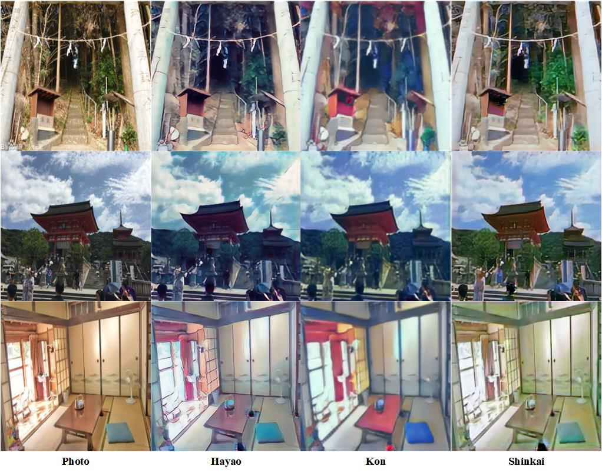

# AnimeGANv2

Anime is a common artistic form in our daily life. This artistic form is widely used in several fields including advertising, film and children’s education.
Currently, the production of animation mainly relies on manual implementation. However, manually creating anime is very laborious and involves substantial artistic skills.
For animation artists, creating high-quality anime works requires careful consideration of lines, textures, colors and shadows, which means that it is difficult and time-consuming to create the works.
Therefore, the automatic techniques that can automatically transform real-world photos to high-quality animation style images are very valuable and necessary.
AnimeGANv2 algorithm can rapidly transform real-world photos into high-quality anime images. AnimeGANv2 is a lightweight generative adversarial model with fewer network parameters.

## Pretrained model

### AnimeGANv2 Model trained by MindSpore

| model                        | style   | ckpt                                                                                      |
| :--------------------------- | :------ | :---------------------------------------------------------------------------------------- |
| animeganv2_generator_Hayao   | Hayao   | [ckpt](https://download.mindspore.cn/vision/animeganv2/animeganv2_generator_Hayao.ckpt)   |
| animeganv2_generator_Paprika | Paprika | [ckpt](https://download.mindspore.cn/vision/animeganv2/animeganv2_generator_Paprika.ckpt) |
| animeganv2_generator_Shinkai | Shinkai | [ckpt](https://download.mindspore.cn/vision/animeganv2/animeganv2_generator_Shinkai.ckpt) |

### Vgg19 model

The pre-trained VGG19 model is used for feature extraction and loss function calculation. Please place this file in the same directory as this file.  
[vgg19 model](https://pan.baidu.com/s/1snIQUxD5XpQZZflhESJOIg?pwd=u6hc)

## Training Parameter description

| Parameter            | Default        | Description                                    |
| :------------------- | :------------- | :--------------------------------------------- |
| device_target        | GPU            | Device type                                    |
| device_id            | 0              | Device ID                                      |
| dataset              | Hayao          | Dataset name                                   |
| data_dir             | ../dataset     | Path of training dataset                       |
| checkpoint_dir       | ../checkpoints | Path to save checkpoint                        |
| vgg19_path           | ../vgg.ckpt    | Path of vgg19                                  |
| save_image_dir       | ../images      | Path to save images                            |
| resume               | False          | Whether to load pretrained model               |
| phase                | train          | Setup phase                                    |
| epochs               | 40             | The number of epochs to run                    |
| init_epochs          | 5              | The number of epochs for weight initialization |
| batch_size           | 4              | The size of batch size                         |
| num_parallel_workers | 1              | Number of parallel workers                     |
| save_interval        | 1              | Save the model during training                 |
| debug_samples        | 0              | Dataset name                                   |
| lr_g                 | 2.0e-4         | Generator learning rate                        |
| lr_d                 | 4.0e-4         | Discriminator learning rate                    |
| init_lr              | 1.0e-3         | Initial learning rate                          |
| gan_loss             | lsgan          | Network loss type                              |
| wadvg                | 1.2            | Adversarial loss weight for Generator          |
| wadvd                | 300            | Adversarial loss weight for Discriminator      |
| wcon                 | 1.8            | Content loss weight                            |
| wgra                 | 2.0            | Gram loss weight                               |
| wcol                 | 10.0           | Color loss weight                              |
| img_ch               | 3              | The size of image channel                      |
| ch                   | 64             | Base channel number per layer                  |
| n_dis                | 3              | The number of discriminator layer              |

## Example

Here, how to use AnimeGANv2 model will be introduced as following.

### Dataset

At first, you should download dataset by yourself.
[Hayao](https://github.com/TachibanaYoshino/AnimeGANv2/releases/download/1.0/Hayao.tar.gz),
[Paprika](https://github.com/TachibanaYoshino/AnimeGANv2/releases/download/1.0/Paprika.tar.gz),
[Shinkai](https://github.com/TachibanaYoshino/AnimeGANv2/releases/download/1.0/Shinkai.tar.gz) and
[real world image](https://github.com/TachibanaYoshino/AnimeGAN/releases/tag/dataset-1) dataset are supported.

After you get the dataset, make sure your path is as following:

```text
.dataset/
    ├── Hayao
           ├──smooth
           └──style
    ├── Paprika
            ├──smooth
            └──style
    ├── Shinkai
            ├──smooth
            └──style
    ├── train_photo
            ├──0.jpg
            ├──1.jpg
            ......
            └──2017-01-03 09_45_13.jpg
```

### Edge Smooth

Before you start to train the model, if you use your own animation dataset, you should first smooth these images.
This step is not necessary if you use the dataset downloaded above.

```text
python edge_smooth.py --style_path dataset/Sakura/smooth/ --output_path dataset/Sakura/style/
```

### Train Model

After you have all the datasets ready, run the train.py to start to train the model.

```text
python train.py --dataset Hayao --batch_size 4 --epochs 40
```

output:

```text
1551it [05:28,  4.74it/s][40/40][1550/1664] Loss_D: 8.6518 Loss_G: 2.0143
1601it [05:38,  4.76it/s][40/40][1600/1664] Loss_D: 16.2060 Loss_G: 1.7243
1651it [05:49,  4.74it/s][40/40][1650/1664] Loss_D: 6.3708 Loss_G: 1.8706
```

### Infer Model

After training, you can use your own image to test your model. Put your image in the infer_image folder, then run infer.py to do inference.

```text
python infer.py --infer_dir ../dataset/test/real --infer_output ../dataset/output --ckpt_file_name ../checkpoints/Hayao/animeganv2_generator_Hayao.ckpt
```

### Video

You can also convert landscape videos in MP4 format to anime style, but the sound of the video will not be retained.

```text
python video2anime.py --video_input ../video/test.mp4 --video_output ../video/output.mp4 --video_ckpt_file_name ../checkpoints/Hayao/animeganv2_generator_Hayao.ckpt
```

### Result

The following is the cartoonization result of a single landscape image of each style.  


The following is the output result of each style of video.  
Original


Hayao


Kon


Shinkai

